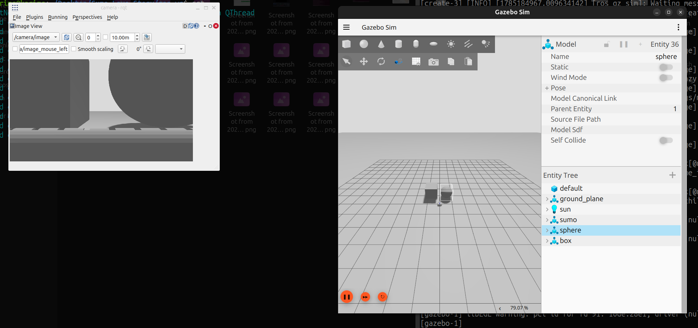
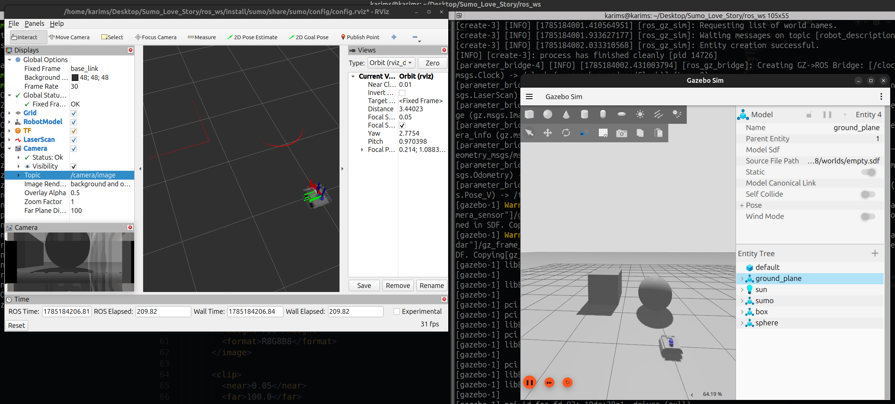
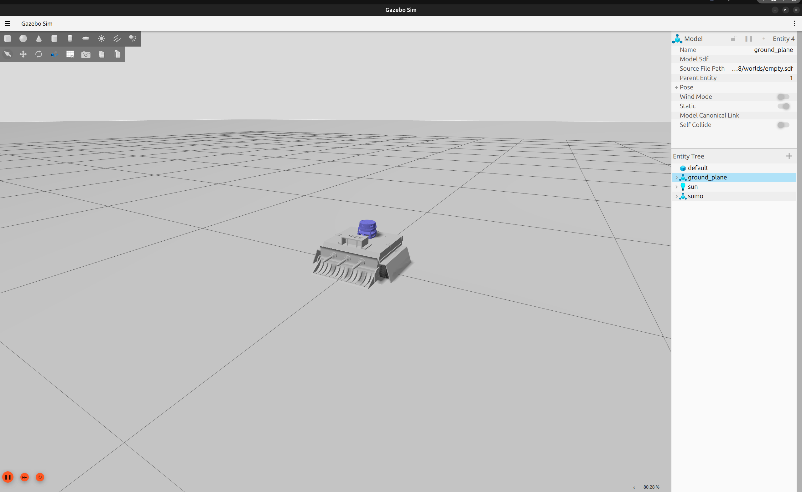
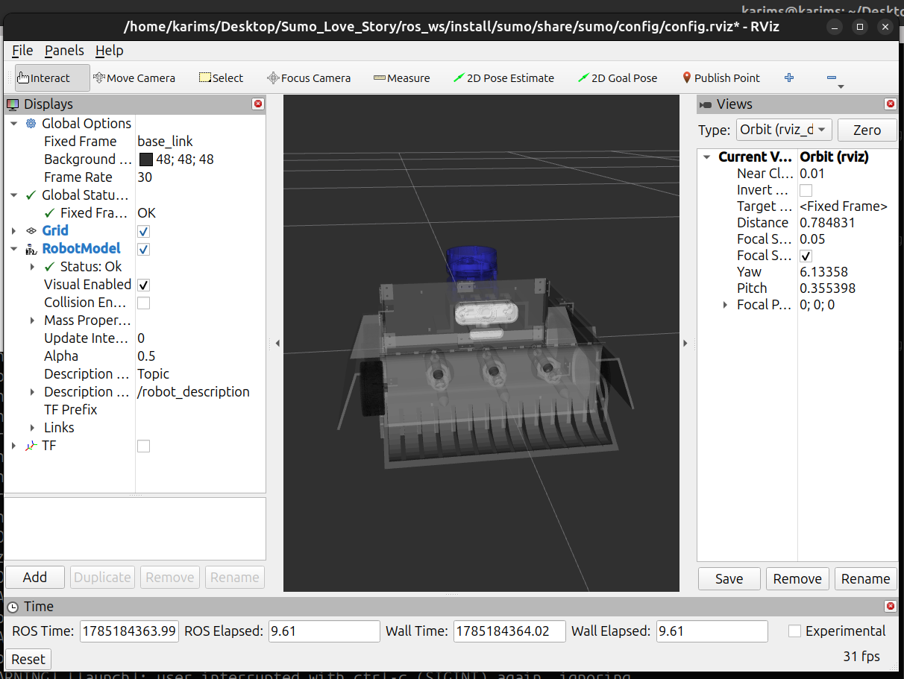
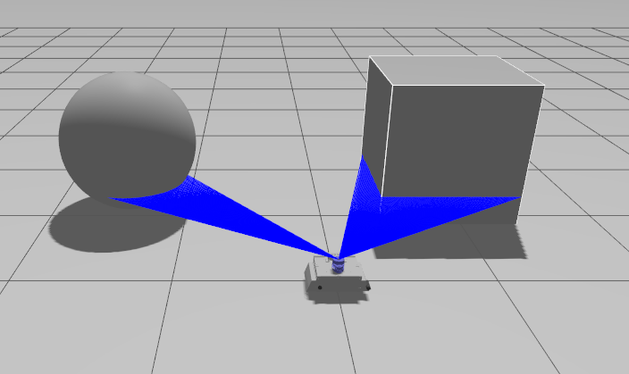
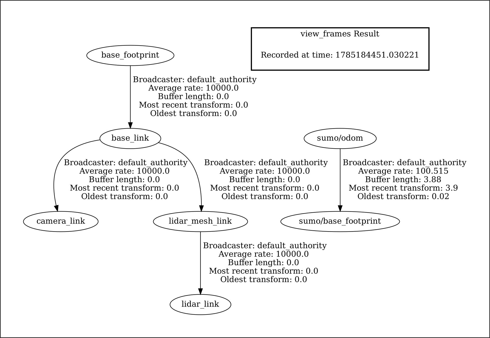
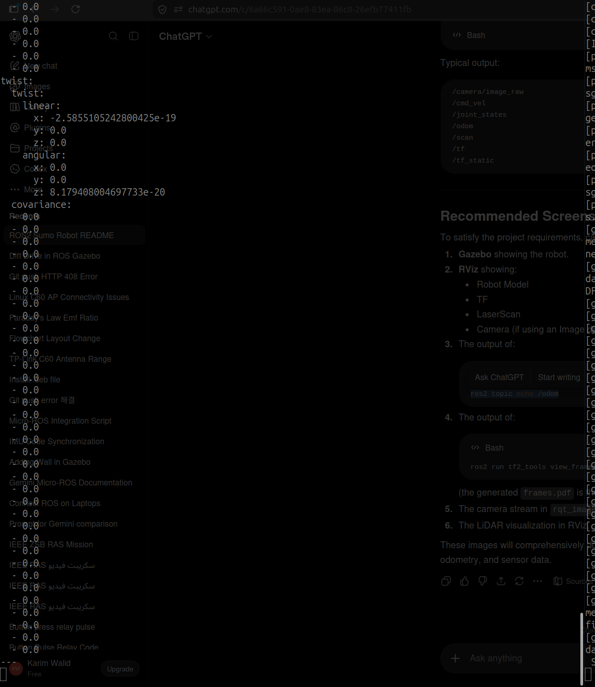

# ROS 2 Sumo Robot

> A ROS 2-based differential drive sumo robot equipped with a forward-facing camera and a 2D LiDAR sensor for perception. The robot is designed for simulation in Gazebo and visualization in RViz2, and is manually controlled through the standard `/cmd_vel` topic.

---

# Table of Contents

- Overview
- Features
- Robot Design
- Mechanical Specifications
- Sensor Configuration
- Attack & Defense Mechanisms
- Software Architecture
- Repository Structure
- Dependencies
- Building the Workspace
- Running the Simulation
- Robot Control
- ROS 2 Topics
- TF Frames
- Camera Stream
- Project Files
- Screenshots
- Demonstration Video
- License

---

# Overview

This project implements a complete ROS 2 simulation of a sumo robot. The simulation includes:

- Differential drive locomotion
- 2D LiDAR
- RGB Camera
- Gazebo simulation
- RViz visualization
- Manual keyboard control
- TF tree
- Odometry
- Sensor publishing

The robot can be extended for autonomous navigation, obstacle avoidance, or vision-based opponent detection.

---

# Features

- Differential Drive Robot
- ROS 2 Jazzy Compatible
- Gazebo Simulation
- RViz Visualization
- Camera Sensor
- LiDAR Sensor
- Keyboard Teleoperation
- Standard `/cmd_vel` Interface
- Modular URDF/Xacro Design

---

# Robot Design

The robot uses a differential drive chassis designed specifically for robot sumo competitions.

## Drive System

- Differential drive
- Two powered wheels
- Passive support mechanism

## Attack Mechanism

The robot uses a **front-mounted spear mechanism** actuated by a tubular solenoid.

- Linear motion
- Forward extension
- Maximum extension: **30 mm**

## Defense Mechanism

Front wedges extend toward both sides of the robot to slide underneath opponent robots during competition.

---

# Mechanical Specifications

| Property | Value |
|-----------|-------|
| Robot Length | **345.9 mm** |
| Wheel Radius | **65 mm** |
| Wheel Separation | **275.5 mm** |
| Ground Clearance | **0.98 mm** |

## Center of Mass

Relative to the robot origin:

| Axis | Value |
|------|------|
| X | +0.36 mm |
| Y | +0.13 mm |
| Z | +51.57 mm |

## Mass of Major Parts

| Component | Mass |
|-----------|------|
| Base Chassis | *To be added* |
| Camera | *To be added* |
| LiDAR | *To be added* |
| Wheels | *To be added* |
| Spear Mechanism | *To be added* |

---

# Sensor Configuration

## Camera

Position relative to robot origin:

- X = +28.70 mm
- Z = +132.20 mm

Viewing direction:

- Forward (First Person)

Image Topic:

```
/camera/image
```

---

## LiDAR

Position relative to robot origin:

- X = -81.77 mm
- Z = +170 mm

LaserScan Topic

```
/scan
```

---

# Software Architecture

```
Keyboard
    │
    ▼
teleop_twist_keyboard
    │
    ▼
/cmd_vel
    │
    ▼
Diff Drive Controller
    │
 ┌──┴─────────────┐
 ▼                ▼
 Wheels       Robot Motion
                   │
      ┌────────────┴────────────┐
      ▼                         ▼
   Camera                   LiDAR
      │                         │
      └────────────┬────────────┘
                   ▼
          Gazebo + RViz2
```

---

# Repository Structure

```
sumo_robot/
│
├── launch/
├── config/
├── urdf/
├── meshes/
├── worlds/
├── rviz/
├── images/
├── scripts/
├── package.xml
├── setup.py
└── README.md
```

---

# Dependencies

- ROS 2 Jazzy
- Gazebo Harmonic
- RViz2
- robot_state_publisher
- joint_state_publisher
- teleop_twist_keyboard
- xacro
- ros_gz_sim
- ros_gz_bridge

---

# Building the Workspace

```bash
cd ~/ros2_ws

colcon build --symlink-install
```

---

# Source the Workspace

```bash
source /opt/ros/jazzy/setup.bash

source install/setup.bash
```

---

# Launch the Robot

```bash
ros2 launch sumo <launch_file>.launch.py
```

---

# Robot Movement

Start keyboard control

```bash
ros2 run teleop_twist_keyboard teleop_twist_keyboard
```

Velocity commands are published to

```
/cmd_vel
```

---

# Important ROS 2 Topics

| Topic | Type | Description |
|--------|------|-------------|
| /cmd_vel | geometry_msgs/Twist | Velocity commands |
| /odom | nav_msgs/Odometry | Robot odometry |
| /scan | sensor_msgs/LaserScan | LiDAR |
| /camera/image | sensor_msgs/Image | Camera |
| /joint_states | sensor_msgs/JointState | Wheel joints |
| /tf | tf2_msgs/TFMessage | TF tree |
| /tf_static | tf2_msgs/TFMessage | Static transforms |

---

# Important TF Frames

- base_link
- base_footprint
- lidar_link
- camera_link
- front_left_wheel_link
- front_right_wheel_link
- rear_left_wheel_link
- rear_right_wheel_link

---

# Camera Stream

Display the camera using:

```bash
rqt_image_view
```


or



Topic:

```
/camera/image
```

---

# Project Files

The repository includes:

- Complete ROS 2 package
- Complete CAD assembly
- STL files for all major robot parts
- URDF/Xacro files
- Gazebo plugin configuration
- Gazebo sensor configuration
- Gazebo–ROS 2 bridge configuration
- Launch files
- RViz configuration
- Camera configuration
- Mechanical specifications
- Assembly image
- package.xml
- CMakeLists.txt
- Parameter files

---

# Screenshots

## Robot in Gazebo

> Insert screenshot



---

## Robot in RViz

> Insert screenshot



---

## LiDAR Visualization

> Insert screenshot



---

## TF Tree

> Insert screenshot



---

## ROS 2 Topics

### /odom

> Insert screenshot



---

### Sensor Topics

> Insert screenshot


---

# Demonstration Video

```
https://youtu.be/your_video_here
```
