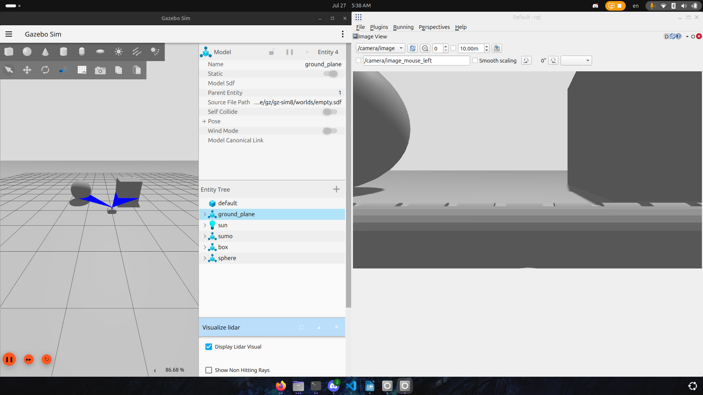

# ROS 2 Sumo Robot

A ROS 2 based autonomous sumo robot platform equipped with a **2D LiDAR** and a **camera** for environmental perception. The robot can be **manually controlled** through the standard `/cmd_vel` topic, making it suitable for testing navigation algorithms, computer vision, and robot control in simulation or on real hardware.

---

## Features

- 📷 Live camera streaming
- 📡 2D LiDAR scanning
- 🎮 Manual control using the `/cmd_vel` topic
- 🤖 ROS 2 compatible
- 🔄 Modular sensor integration
- 🏟️ Designed for Sumo Robot applications

---

## Robot Overview

The robot consists of the following main components:

- Differential drive mobile base
- Camera sensor
- 2D LiDAR sensor
- ROS 2 control interface
- Velocity control via `/cmd_vel`

---

# Camera View

The robot publishes live camera images that can be viewed using **RViz2**, **rqt_image_view**, or any ROS 2 image subscriber.

> Replace the placeholder below with a screenshot of the camera feed.

<p align="center">
  
</p>

---

# LiDAR Visualization

The LiDAR provides a 360° scan of the surrounding environment and can be visualized in **RViz2**.

> Replace the placeholder below with a screenshot of the LiDAR scan.

<p align="center">
  
</p>

---

# Topics

| Topic | Type | Description |
|--------|------|-------------|
| `/cmd_vel` | `geometry_msgs/msg/Twist` | Robot velocity commands |
| `/scan` | `sensor_msgs/msg/LaserScan` | LiDAR scan data |
| `/camera/image_raw` | `sensor_msgs/msg/Image` | Raw camera images |

---

# Manual Control

The robot is controlled through the standard ROS 2 **`/cmd_vel`** topic.

### Keyboard Teleoperation

```bash
ros2 run teleop_twist_keyboard teleop_twist_keyboard
```

The teleoperation node publishes velocity commands to:

```
/cmd_vel
```

which controls the robot's linear and angular velocities.

---

## Visualizing the Sensors

### RViz2

Launch RViz2:

```bash
rviz2
```

Add the following displays:

- LaserScan (`/scan`)
- Image (`/camera/image_raw`)
- RobotModel
- TF

---

## Project Structure

```text
sumo_/
├── launch/
├── config/
├── urdf/
├── meshes/
├── worlds/
├── src/
└── README.md
```

---

## Requirements

- ROS 2 (Jazzy, Humble, or newer)
- RViz2
- teleop_twist_keyboard
- LiDAR driver
- Camera driver

---

## Example Workflow

```text
Keyboard
    │
    ▼
teleop_twist_keyboard
    │
    ▼
/cmd_vel
    │
    ▼
Robot Controller
    │
 ┌──┴────────────┐
 │               │
 ▼               ▼
Motors       Sensor Data
                 │
        ┌────────┴─────────┐
        ▼                  ▼
     Camera             LiDAR
        │                  │
        └────────┬─────────┘
                 ▼
               RViz2
```

---

## Future Improvements

- Autonomous opponent detection
- Object tracking
- Obstacle avoidance
- SLAM integration
- Navigation2 support

---
---

# Robot Specifications

| Specification | Value |
|---------------|-------|
| **Robot Length** | **345.9 mm** |
| **Wheel Radius** | **65 mm** |
| **Wheel Separation** | **275.5 mm** (center-to-center) |
| **Ground Clearance** | **0.98 mm** |
| **Center of Mass** | X = **+0.36 mm**, Y = **+0.13 mm**, Z = **+51.57 mm** (relative to robot origin) |

---

# Sensor Configuration

## LiDAR

- **Position**
  - X = **-81.77 mm**
  - Z = **+170 mm**
- Position is measured relative to the robot origin.

## Camera

- **Position**
  - X = **+28.70 mm**
  - Z = **+132.20 mm**
- **Viewing Direction**
  - Forward-facing (first-person view)

---

# Mechanical Design

## Attack Mechanism

The robot uses a **front-mounted spear mechanism** driven by a **tubular solenoid shaft**. The spear performs a linear forward motion and can extend an additional **30 mm (3 cm)** beyond its resting position.

## Defense Mechanism

The defensive structure consists of **front wedges** extending from the front toward both sides of the robot. These wedges are designed to lift or deflect opponent robots during a sumo match.

---

# Moving Joints

| Joint | Motion | Travel |
|--------|--------|--------|
| Tubular Solenoid Shaft | Linear (Forward) | 30 mm |

---

# CAD Assets

- ✔ STL files for all robot parts
- ✔ Complete assembly model
- ✔ Front direction defined

---

# Sensor Mounting Locations

```
                Front
                  ▲
                  │

        Camera
     X = +28.70 mm
     Z = +132.20 mm
          │

      Robot Origin

          │

        LiDAR
     X = -81.77 mm
     Z = +170.00 mm

                  ▼
                 Rear
```

